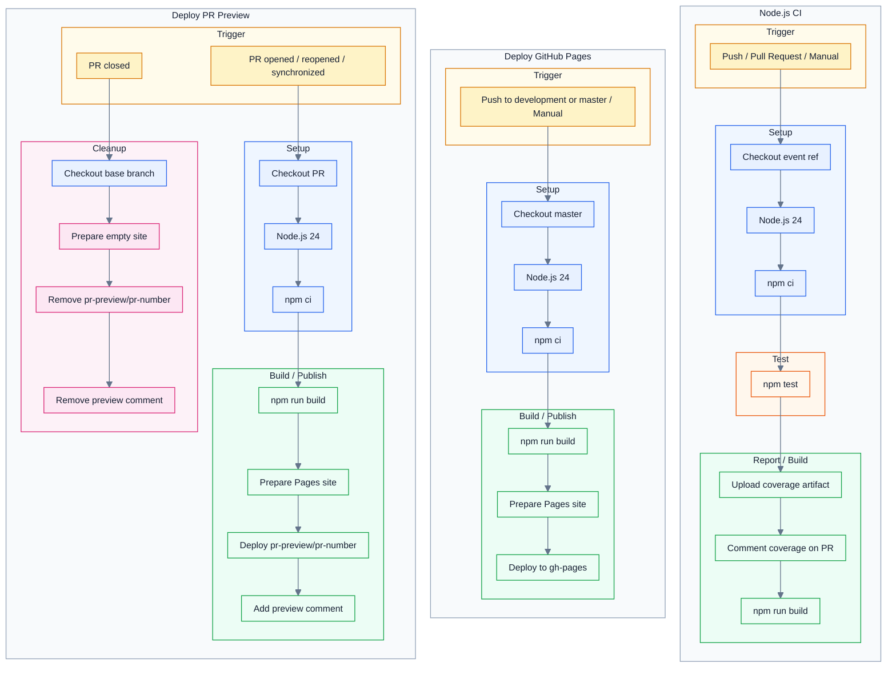

# CI Workflows

This chart documents the Node.js CI, production GitHub Pages, and pull request preview workflows.

The PR coverage comment displays a static image for mobile users and links back to this source chart for desktop users.