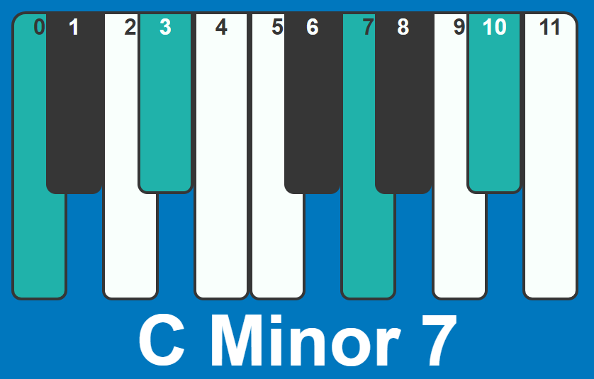

<!-- using shields.io for status buttons -->


# Chord Finder 🎹❓

Javascript web application that tells you what chord you are playing. Click on the notes to build your chord! 

I started by rewriting my own C++ [console application](https://github.com/ManuelVargas1251/ChordFinder) to javascript and added the interface as I went. Still a work in progress.

[View Demo](https://mnl.space/Chord-Finder/)



### Console Usage
If you don't like the interface you can easily call the functions from the [Chrome Console](https://developers.google.com/web/tools/chrome-devtools/console/)  or use them in your own project.

To find a chord name, use the `updateChord()` function and pass in an array with the notes you want. 

```javascript
updateChord(["A", "C#", "E", "G#"])	//  A Major 7
```

## Interval Library
Below is how I store the relations of the note intervals as well as grouping of intervals commonly called chords.

### Interval Reference

| Interval Name     | Interval	|
| -------------- 	|:-----:|
| Perfect Unison 	|	0, 1|
| Minor Second   	|	2	|
| Major Second 	 	|	3 	|
| Minor Third    	|	4	|
| Major Third	    |	5 	|
| Perfect Fourth	|	6 	|
| Augmented Fourth	|	7 	|
| Diminished Fifth	|	7 	|
| Perfect Fifth    	|	8 	|
| Minor Sixth  	   	|	9 	|
| Major Sixth     	|	10 	|
| Minor Seventh   	|	11 	|
| Major Seventh   	|	12 	|
| Perfect Octave  	|	13 	|

### Chord Reference

| Chord Name			| Interval Values			|
| ----------			| --------------			|
|	Major				|	```[5, 4]```			| 
|	Minor				|	```[4, 5]```			|
|	Augmented			|	```[5, 5]```			| 	
|	Diminished			|	```[4, 4]```			| 	
|	Major 7				|	```[5, 4, 5]```			|
|	Minor 7				|	```[4, 5, 4]```			|
|	Augmented 7			|	```[5, 5, 3]```			|
|	Dominant 7th		|	```[5, 4, 4]```			|	
|	Augmented Major 7	|	```[5, 5, 4]```			|
|	Fully Diminished 7	|	```[4, 4, 4]```			|
|	Half-Diminished  	|	```[4, 4, 5]```			|
|	Minor Major 7 		|	```[4, 5, 5]```			|	
|	Major 9th			|	```[5, 4, 5, 4]```		|	
|	Dominant 9th		|	```[5, 4, 4, 5]```		|
|	Dominant 11th		|	```[5, 4, 4, 5, 4]```	|
|	Dominant 13th		|	```[5, 4, 4, 5, 4, 5]```|


# Reference

[Chord Wiki](https://en.wikipedia.org/wiki/Chord_(music))

