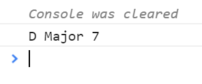
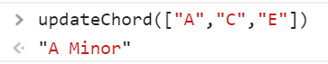

<!-- using shields.io for status buttons -->


# Chord Finder

Javascript web app redo from my C++ [console app](https://github.com/ManuelVargas1251/ChordFinder).

[View Demo (Browser Console Only)](https://mnl.space/Chord-Finder/)

## Usage

Currently this is a console app while I work on the javascript. To use, click on the demo link above, open the [Chrome Console](https://developers.google.com/web/tools/chrome-devtools/console/) (F12) (or equivalent browser console) and you should see an inital chord already executed (if it's not, the program is broken and you should come back later 😞). 



To find a chord name, use the `updateChord()` function and pass in an array with the notes you want. 



```javascript
updateChord(["A","C","E"])	//	Result => A Minor
```

## Interval Reference
I'm storing aconstant var with thsi information to be able to be read-only

| Interval Name     | Interval	|
| -------------- 	|:-----:|
| Perfect Unison 	|	0, 1|
| Minor Second   	|	2	|
| Major Second 	 	|	3 	|
| Minor Third    	|	4	|
| Major Third	    |	5 	|
| Perfect Fourth	|	6 	|
| Augmented Fourth	|	7 	|
| Diminished Fifth	|	7 	|
| Perfect Fifth    	|	8 	|
| Minor Sixth  	   	|	9 	|
| Major Sixth     	|	10 	|
| Minor Seventh   	|	11 	|
| Major Seventh   	|	12 	|
| Perfect Octave  	|	13 	|

## Chord Reference
4 Triads, 8 Tetrads 

| Chord Name			| Interval Group			|	Chord Type	|
| ----------			| --------------			|:-----------------:|
|	Major				|	```[5, 4]```			| 	Triad	|
|	Minor				|	```[4, 5]```			| 	Triad	|
|	Augmented			|	```[5, 5]```			| 	Triad	|
|	Diminished			|	```[4, 4]```			| 	Triad	|
|	Major 7				|	```[5, 4, 5]```			|	Seventh	|
|	Minor 7				|	```[4, 5, 4]```			|	Seventh	|
|	Augmented 7			|	```[5, 5, 3]```			|	Seventh	|
|	Dominant 7th		|	```[5, 4, 4]```			|	Seventh	|
|	Augmented Major 7	|	```[5, 5, 4]```			|	Seventh	|
|	Fully Diminished 7	|	```[4, 4, 4]```			|	Seventh	|
|	Half-Diminished  	|	```[4, 4, 5]```			|	Seventh	|
|	Minor Major 7 		|	```[4, 5, 5]```			|	Seventh	|
|	Major 9th			|	```[5, 4, 5, 4]```		|	Extended 	|
|	Dominant 9th		|	```[5, 4, 4, 5]```		|	Extended 	|
|	Dominant 11th		|	```[5, 4, 4, 5, 4]```	|	Extended 	|
|	Dominant 13th		|	```[5, 4, 4, 5, 4, 5]```|	Extended 	|


# Reference

[Chord Wiki](https://en.wikipedia.org/wiki/Chord_(music))

