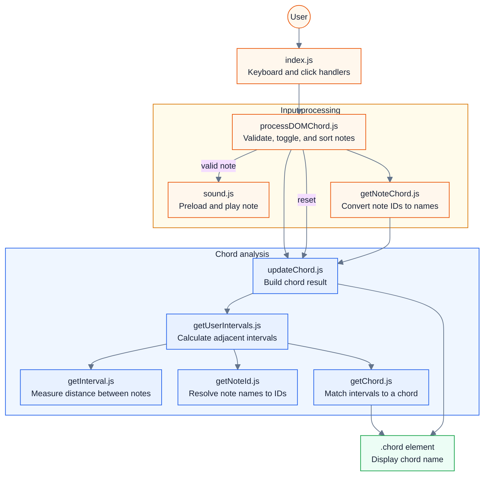
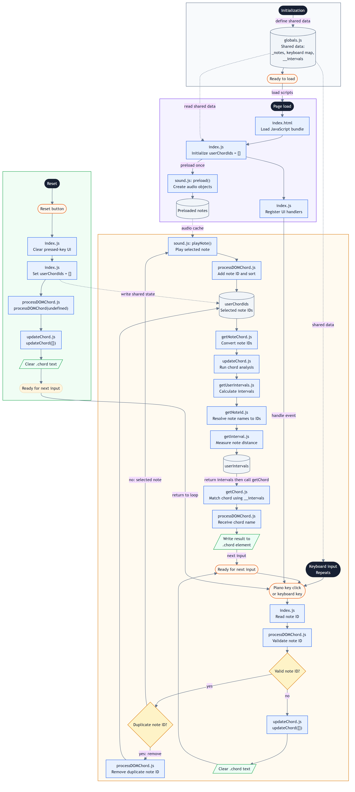

<!-- using shields.io for status buttons -->


[](https://github.com/ManuelVargas1251/Chord-Finder/actions/workflows/node-ci.yml?query=branch%3Amaster)
[](https://github.com/ManuelVargas1251/Chord-Finder/actions/workflows/node-ci.yml?query=branch%3Adevelopment)
[](https://jestjs.io/)

# Chord Finder 🎹

Chord Finder is a JavaScript web application that identifies the chord you are playing on the piano, including inversions. Click the piano keys or use the mapped computer-keyboard controls to build a chord. Select two notes to identify the interval between them.

I started by rewriting my previous C++ chord finder [console application](https://github.com/ManuelVargas1251/ChordFinder) in JavaScript and added the web interface as I went.

[View Web Application](https://mnl.space/Chord-Finder/)


## Event Handlers

Code is triggered by clicking or pressing keys on the keyboard UI.
The example assumes `index.js` has already initialized `userChordIds` and preloaded the note audio with `notes = sound.preload()`.
```javascript
// mouse click on piano key event
$(".key").click(function () {
	//pass note id to add to chord
	let noteCode = $(this).attr('id')
	$(this).toggleClass("pressed")	//toggle key color key when pressed
	processDOMChord(noteCode, userChordIds, notes)
})

// keyboard keypress event
$("html").keypress(function (element) {
	let noteCode = _computerKeyboardMap.get(element.which)
	$("#" + noteCode).toggleClass("pressed")
	processDOMChord(noteCode, userChordIds, notes)
})

// reset button event
$(".reset").click(function (){
	userChordIds.forEach((v)=>$("#" + v).toggleClass("pressed"))
	userChordIds = []
	processDOMChord(undefined, userChordIds)
})
```


## Unit Testing & Coverage

Using [Jest](https://jestjs.io/) for unit testing. GitHub Actions runs on pushes to, and pull requests targeting, `master` or `development`. The workflow uses Node.js 24, runs the tests with coverage, uploads the full coverage report as an artifact, and builds the Browserify bundle. Same-repository pull requests also receive a coverage summary comment.


```bash
# clean install the locked dependency versions
npm ci

# run tests with coverage
npm test

# rebuild the browser bundle.js
npm run build
```

Coverage thresholds are 100% for statements, functions, and lines, with 95% branch coverage. Use `npm run jest-watch` for an interactive test watcher.

## Deployments

The production site is available at [mnl.space/Chord-Finder](https://www.mnl.space/Chord-Finder/). The production workflow rebuilds the bundle and publishes the `master` branch contents to GitHub Pages.

Pull requests targeting `development` or `master` receive a preview deployment at:

```text
https://www.mnl.space/Chord-Finder/pr-preview/pr-<number>/
```

The preview workflow runs when a pull request is opened, reopened, updated, or closed. The preview link is added to the pull request using the URL pattern above, and the preview is removed when the pull request closes. Preview deployments are available for pull requests from this repository; forked pull requests are not deployed.

## Development Setup
Use a local server to avoid CORS errors when testing sound. The project uses Browserify to bundle the JavaScript files into `src/js/bundle.js`; VS Code Live Server is one option for serving the project locally.

Use Node.js 24 and npm to match the CI environment. The repository's lockfile keeps dependency versions consistent, so install dependencies with `npm ci` rather than relying on a globally installed tool or an unpinned `npx` package.
```bash
# download the repo locally from github and cd into the folder
gh repo clone ManuelVargas1251/Chord-Finder
cd Chord-Finder

# install the locked dependencies, including Browserify
npm ci

# rebuild the bundle after changing JavaScript files
npm run build
```

## Application Architecture


```mermaid
%%{init: {'theme': 'base', 'themeVariables': {'fontSize': '12px', 'primaryTextColor': '#172033', 'lineColor': '#64748b'}, 'flowchart': {'nodeSpacing': 24, 'rankSpacing': 30, 'padding': 8}}}%%
flowchart TB
	user((User)) --> events["index.js<br/>Keyboard and click handlers"]
	events --> process["processDOMChord.js<br/>Validate, toggle, and sort notes"]

	subgraph inputWork["Input processing"]
		direction TB
		process -->|valid note| sound["sound.js<br/>Preload and play note"]
		process --> noteNames["getNoteChord.js<br/>Convert note IDs to names"]
	end

	process --> update["updateChord.js<br/>Build chord result"]
	process -->|reset| update

	subgraph analysis["Chord analysis"]
		direction TB
		update --> intervals["getUserIntervals.js<br/>Calculate adjacent intervals"]
		intervals --> interval["getInterval.js<br/>Measure distance between notes"]
		intervals --> noteId["getNoteId.js<br/>Resolve note names to IDs"]
		intervals --> chord["getChord.js<br/>Match intervals to a chord"]
	end

	noteNames --> update
	chord --> display[".chord element<br/>Display chord name"]
	update --> display

	classDef inputStyle fill:#fff7ed,stroke:#ea580c,color:#172033
	classDef analysisStyle fill:#e8f1ff,stroke:#2563eb,color:#172033
	classDef outputStyle fill:#ecfdf5,stroke:#16a34a,color:#172033
	class user,events,process,sound,noteNames inputStyle
	class update,intervals,interval,noteId,chord analysisStyle
	class display outputStyle
	style inputWork fill:#fffbeb,stroke:#d97706,color:#172033
	style analysis fill:#eff6ff,stroke:#2563eb,color:#172033
```

The [canonical Mermaid source](docs/app-architecture.mmd) is also available separately. The static image is available as a fallback for clients that do not render Mermaid diagrams.

<details>
<summary>View static chart fallback</summary>



</details>


## Environments
By using https://raw.githack.com/ I created working lower environments to test code in any committed branch. The CI badges above report the latest GitHub Actions status separately for `master` and `development`.


[Production](https://mnl.space/Chord-Finder/)


[Development](https://raw.githack.com/ManuelVargas1251/Chord-Finder/development/index.html)


# Reference

[Musical Chord Wiki](https://en.wikipedia.org/wiki/Chord_(music))

[Musical Interval Wiki](https://en.wikipedia.org/wiki/Interval_(music))

[Eleventh Interval Wiki](https://en.wikipedia.org/wiki/Eleventh)

[Octave Interval Wiki](https://en.wikipedia.org/wiki/Octave)

